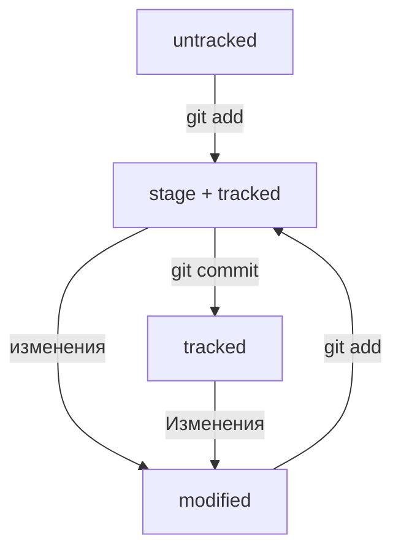

# Тестовый проект - шпаргалка по работе с Git:

## Задание:
```
1) Создайте репозиторий
2) Добавьте в репозиторий файл README.md и запишите в него всё, что уже знаете. Это могут быть: список команд и понятий по каждой из пройденных тем; инструкции по инициализации проекта, работе с коммитами и регистрации на GitHub или просто поурочные конспекты в свободной форме.
3) Загрузите получившийся репозиторий на GitHub и убедитесь, что локальная и удалённая версии идентичны.
```

## Решение:
1) На Gitlab создал репозиторий с именем test1 (через интерфейсе gitlab)

2) Локально добавил папку test1. Далее чтобы папка стала репозиторием ее нужно инициализировать. Для этого нужно в нее перейти и инициализировать: <br>
__cd test1__ <br>
__git init__ <br>
__git status__ - проверка состояния репозитория <br>
Для справки. Создание файла команда touch (или просто через GUI) <br>

3) Далее добавляем все файлы папки для отслеживания: 
__git add .__ <br>
и коммитим: <br>
__git commit -m "Первый коммит файла"__ <br>
Далее вносим в файл изменения и опять добавляем и коммитим <br>
__git add README.md__ <br>
__git commit -m "Второй коммит файла"__ <br>

4) Чтобы просомотреть историю коммитов: <br>
__git log__ <br>
Получить сокращённый лог можно с помощью команды __git log --oneline__ <br>

5) Далее нужно связать удаленный (см п.1) и локальные репозитории (см. п.2). Для этого нужно выполнить команды, которые приведены в секции *"…or push an existing repository from the command line"* на первой странице репозитория на gitlab (Но нужно перейти в директорию репозитория!).  <br>

Перед связыванием репозиториев необходимо настроить SSH-ключи.Но прежде чем генерировать SSH-ключи, убедитесь, что у вас их ещё нет. По умолчанию директория с SSH-ключами находится в домашней директории пользователя. Перейдите в неё: <br>
```
$ cd ~ # перешли в домашнюю директорию
```

Обычно SSH-ключи находятся в директории .ssh/. Проверить наличие этой директории и файлов в ней можно с помощью следующей команды. <br>
```
$ ls -la .ssh/ # вывели список созданных ключей 
```

Если папка пустая или её нет, всё в порядке. <br>
Если есть файлы с похожими названиями, SSH-ключи уже создавались: id_dsa.pub; id_ecdsa.pub; id_ed25519.pub; id_rsa.pub. <br>
Если вы не создавали эти файлы, удалите их все.

----

### Инструкция по генерации SSH-ключа
1. Для генерации SSH-пары можно использовать программу ssh-keygen. Откройте терминал и введите следующую команду.
```
$ ssh-keygen -t ed25519 -C "электронная почта, к которой привязан ваш аккаунт на GitHub" 
```
Используйте электронную почту, к которой привязан ваш GitHub-аккаунт.
Если вы видите сообщение об ошибке, то, скорее всего, ваша система не поддерживает алгоритм шифрования ed25519. Ничего страшного: используйте другой алгоритм.
```
$ ssh-keygen -t rsa -b 4096 -C "электронная почта, к которой привязан ваш аккаунт на GitHub"
```
После ввода отобразится такое сообщение.
```
> Generating public/private rsa key pair. # сгенерированы публичный и приватный ключи 
```
2. Укажите место хранения ключей. Простой вариант — сделать домашний каталог пользователя путём по умолчанию. Для этого нажмите Enter.
(для Windows)
```
> Enter a file in which to save the key (C:\Users\<имя_пользователя>\.ssh\):[Press enter] 
```
Теперь в указанной директории появится пара ключей.

3. Программа запросит кодовую фразу (англ. passphrase) для доступа к SSH-ключу. Вы можете оставить поле пустым. Для этого нажмите Enter, а затем ещё раз Enter для подтверждения.
```
> Enter passphrase (empty for no passphrase): [Type a passphrase]
> Enter same passphrase again: [Type passphrase again] 
```
4. Готово! Теперь осталось проверить, что ключи действительно сгенерировались. Для этого вызовите эту команду.
```
ls -a ~/.ssh 
```
На экране должны появиться два файла — один с расширением .pub, другой — без. Файл в .pub — публичный, им можно делиться с веб-сайтами или коллегами. Файл без расширения .pub — приватный. Ни в коем случае не передавайте его никому! <br>
 <br>

----

6) Убедимся, что репозитории связаны: <br>
__git remote -v__
В результате выполнения команды должны вывестить две строки:
```
git remote -v
origin    git@github.com:%ИМЯ_АККАУНТА%/%ИМЯ-ПРОЕКТА%.git (fetch)
origin    git@github.com:%ИМЯ_АККАУНТА%/%ИМЯ-ПРОЕКТА%.git (push)
```
7) Изменения из локального репозитория в удаленный отправляются командой: <br>
__git push__ <br>

В первый раз эту команду нужно вызвать с флагом -u и параметрами origin (имя удалённого репозитория) и main или master (название текущей ветки). Флаг -u свяжет локальную ветку с одноимённой удалённой. Как вы связывали локальный и удалённый репозитории в предыдущем уроке, так же и здесь нужно дополнительно связать ветки. <br>

```
$ git push -u origin main # Если команда приведёт к ошибке, попробуйте 
                          # заменить main на master. 
```

----

### Информацию из уроков о хеше, логе, HEAD,

#### Файл HEAD

Файл __HEAD__ — один из служебных файлов папки .git. Он указывает на коммит, который сделан последним (то есть на самый новый). <br>

Вместо хеша последнего коммита можно написать слово HEAD — Git вас поймёт.

#### Статусы файлов в Git

Одна из ключевых задач Git — отслеживать изменения файлов в репозитории. Для этого каждый файл помечается каким-либо статусом. Рассмотрим основные. <br>

__untracked (англ. «неотслеживаемый»)__ <br>

Новые файлы в Git-репозитории помечаются как untracked, то есть неотслеживаемые. Git «видит», что такой файл существует, но не следит за изменениями в нём. У untracked-файла нет предыдущих версий, зафиксированных в коммитах или через команду git add. <br>

__staged (англ. «подготовленный»)__ <br>
После выполнения команды git add файл попадает в staging area (от англ. stage — «сцена», «этап [процесса]» и area — «область»), то есть в список файлов, которые войдут в коммит. В этот момент файл находится в состоянии staged. <br>

Команда git add добавляет в staging area только текущее содержимое файла. Если вы, например, сделаете git add file.txt, а затем измените file.txt, то новое содержимое файла не будет находиться в staging. <br>

__tracked (англ. «отслеживаемый»)__ <br>
Состояние tracked — это противоположность untracked. Оно довольно широкое по смыслу: в него попадают файлы, которые уже были зафиксированы с помощью git commit, а также файлы, которые были добавлены в staging area командой git add. То есть все файлы, в которых Git так или иначе отслеживает изменения. <br>

__modified (англ. «изменённый»)__ <br)
Состояние modified означает, что Git сравнил содержимое файла с последней сохранённой версией и нашёл отличия. Например, файл был закоммичен и после этого изменён. <br>

Git сообщит об этом с помощью статуса modified: файл изменён относительно той версии, которая уже в staging. Чтобы добавить в staging последнюю версию, нужно выполнить git add file.txt ещё раз. <br>

#### Типичный жизненный цикл файла в Git


### Как исправить коммит

Иногда в только что выполненном коммите нужно что-то поменять: например, добавить ещё пару файлов или заменить сообщение на более информативное. <br>
В таком случае можно внести правки в уже сделанный коммит с помощью опции --amend (от англ. amend — «исправить», «дополнить») у команды commit: __git commit --amend__. <br>
Опция --amend работает только с последним коммитом (HEAD). <br>
<br>
__Как это работает:__
- Если забыли файл к коммиту, то нужно его добавить через __git add <имя файла>__ <br>
- Далее добавить в коммит __git commit --amend --no-edit__ (если не нужно править комментарий) или __git commit --amend -m "Комментарий"__ (если нужно править комментарий) <br>

