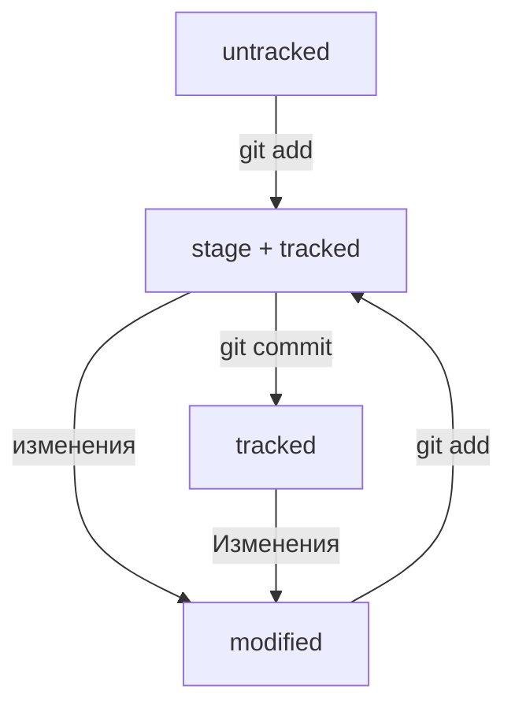

# Тестовый проект - шпаргалка по работе с Git:

## Задание:
```
1) Создайте репозиторий
2) Добавьте в репозиторий файл README.md и запишите в него всё, что уже знаете. Это могут быть: список команд и понятий по каждой из пройденных тем; инструкции по инициализации проекта, работе с коммитами и регистрации на GitHub или просто поурочные конспекты в свободной форме.
3) Загрузите получившийся репозиторий на GitHub и убедитесь, что локальная и удалённая версии идентичны.
```

## Решение:
1) На Gitlab создал репозиторий с именем test1 (через интерфейсе gitlab)

2) Локально добавил папку test1. Далее чтобы папка стала репозиторием ее нужно инициализировать. Для этого нужно в нее перейти и инициализировать: <br>
`cd test1` <br>
`git init` <br>
`git status` - проверка состояния репозитория <br>
Для справки. Создание файла команда touch (или просто через GUI) <br>

3) Далее добавляем все файлы папки для отслеживания: 
`git add .` <br>
и коммитим: <br>
`git commit -m "Первый коммит файла"` <br>
Далее вносим в файл изменения и опять добавляем и коммитим <br>
`git add README.md` <br>
`git commit -m "Второй коммит файла"` <br>

4) Чтобы просомотреть историю коммитов: <br>
`git log` <br>
Получить сокращённый лог можно с помощью команды `git log --oneline` <br>

5) Далее нужно связать удаленный (см п.1) и локальные репозитории (см. п.2). Для этого нужно выполнить команды, которые приведены в секции *"…or push an existing repository from the command line"* на первой странице репозитория на gitlab (Но нужно перейти в директорию репозитория!).  <br>

Перед связыванием репозиториев необходимо настроить SSH-ключи.Но прежде чем генерировать SSH-ключи, убедитесь, что у вас их ещё нет. По умолчанию директория с SSH-ключами находится в домашней директории пользователя. Перейдите в неё: <br>
```
$ cd ~ # перешли в домашнюю директорию
```

Обычно SSH-ключи находятся в директории .ssh/. Проверить наличие этой директории и файлов в ней можно с помощью следующей команды. <br>
```
$ ls -la .ssh/ # вывели список созданных ключей 
```

Если папка пустая или её нет, всё в порядке. <br>
Если есть файлы с похожими названиями, SSH-ключи уже создавались: id_dsa.pub; id_ecdsa.pub; id_ed25519.pub; id_rsa.pub. <br>
Если вы не создавали эти файлы, удалите их все.

----

### Инструкция по генерации SSH-ключа
1. Для генерации SSH-пары можно использовать программу ssh-keygen. Откройте терминал и введите следующую команду.
```
$ ssh-keygen -t ed25519 -C "электронная почта, к которой привязан ваш аккаунт на GitHub" 
```
Используйте электронную почту, к которой привязан ваш GitHub-аккаунт.
Если вы видите сообщение об ошибке, то, скорее всего, ваша система не поддерживает алгоритм шифрования ed25519. Ничего страшного: используйте другой алгоритм.
```
$ ssh-keygen -t rsa -b 4096 -C "электронная почта, к которой привязан ваш аккаунт на GitHub"
```
После ввода отобразится такое сообщение.
```
> Generating public/private rsa key pair. # сгенерированы публичный и приватный ключи 
```
2. Укажите место хранения ключей. Простой вариант — сделать домашний каталог пользователя путём по умолчанию. Для этого нажмите Enter.
(для Windows)
```
> Enter a file in which to save the key (C:\Users\<имя_пользователя>\.ssh\):[Press enter] 
```
Теперь в указанной директории появится пара ключей.

3. Программа запросит кодовую фразу (англ. passphrase) для доступа к SSH-ключу. Вы можете оставить поле пустым. Для этого нажмите Enter, а затем ещё раз Enter для подтверждения.
```
> Enter passphrase (empty for no passphrase): [Type a passphrase]
> Enter same passphrase again: [Type passphrase again] 
```
4. Готово! Теперь осталось проверить, что ключи действительно сгенерировались. Для этого вызовите эту команду.
```
ls -a ~/.ssh 
```
На экране должны появиться два файла — один с расширением .pub, другой — без. Файл в .pub — публичный, им можно делиться с веб-сайтами или коллегами. Файл без расширения .pub — приватный. Ни в коем случае не передавайте его никому! <br>
 <br>

----

6) Убедимся, что репозитории связаны: <br>
`git remote -v`
В результате выполнения команды должны вывестить две строки:
```
git remote -v
origin    git@github.com:%ИМЯ_АККАУНТА%/%ИМЯ-ПРОЕКТА%.git (fetch)
origin    git@github.com:%ИМЯ_АККАУНТА%/%ИМЯ-ПРОЕКТА%.git (push)
```
7) Изменения из локального репозитория в удаленный отправляются командой: <br>
`git push` <br>

В первый раз эту команду нужно вызвать с флагом -u и параметрами origin (имя удалённого репозитория) и main или master (название текущей ветки). Флаг -u свяжет локальную ветку с одноимённой удалённой. Как вы связывали локальный и удалённый репозитории в предыдущем уроке, так же и здесь нужно дополнительно связать ветки. <br>

```
$ git push -u origin main # Если команда приведёт к ошибке, попробуйте 
                          # заменить main на master. 
```

----

### Информацию из уроков о хеше, логе, HEAD,

#### Файл HEAD

Файл `HEAD` — один из служебных файлов папки .git. Он указывает на коммит, который сделан последним (то есть на самый новый). <br>

Вместо хеша последнего коммита можно написать слово HEAD — Git вас поймёт.

#### Статусы файлов в Git

Одна из ключевых задач Git — отслеживать изменения файлов в репозитории. Для этого каждый файл помечается каким-либо статусом. Рассмотрим основные. <br>

`untracked (англ. «неотслеживаемый»)` <br>

Новые файлы в Git-репозитории помечаются как untracked, то есть неотслеживаемые. Git «видит», что такой файл существует, но не следит за изменениями в нём. У untracked-файла нет предыдущих версий, зафиксированных в коммитах или через команду git add. <br>

`staged (англ. «подготовленный»)` <br>
После выполнения команды git add файл попадает в staging area (от англ. stage — «сцена», «этап [процесса]» и area — «область»), то есть в список файлов, которые войдут в коммит. В этот момент файл находится в состоянии staged. <br>

Команда git add добавляет в staging area только текущее содержимое файла. Если вы, например, сделаете git add file.txt, а затем измените file.txt, то новое содержимое файла не будет находиться в staging. <br>

`tracked (англ. «отслеживаемый»)` <br>
Состояние tracked — это противоположность untracked. Оно довольно широкое по смыслу: в него попадают файлы, которые уже были зафиксированы с помощью git commit, а также файлы, которые были добавлены в staging area командой git add. То есть все файлы, в которых Git так или иначе отслеживает изменения. <br>

`modified (англ. «изменённый»)` <br)
Состояние modified означает, что Git сравнил содержимое файла с последней сохранённой версией и нашёл отличия. Например, файл был закоммичен и после этого изменён. <br>

Git сообщит об этом с помощью статуса modified: файл изменён относительно той версии, которая уже в staging. Чтобы добавить в staging последнюю версию, нужно выполнить git add file.txt ещё раз. <br>

#### Типичный жизненный цикл файла в Git


----
### Как исправить коммит

Иногда в только что выполненном коммите нужно что-то поменять: например, добавить ещё пару файлов или заменить сообщение на более информативное. <br>
В таком случае можно внести правки в уже сделанный коммит с помощью опции --amend (от англ. amend — «исправить», «дополнить») у команды commit: `git commit --amend`. <br>
Опция --amend работает только с последним коммитом (HEAD). <br>
<br>
`Как это работает:`
- Если забыли файл к коммиту, то нужно его добавить через `git add <имя файла>` <br>
- Далее добавить в коммит `git commit --amend --no-edit` (если не нужно править комментарий) или `git commit --amend -m "Комментарий"` (если нужно править комментарий) <br>

----
### Как откатиться назад, если «всё сломалось»

На разных этапах работы с Git могут происходить похожие ситуации: <br>
- В список на коммит попал лишний файл (например, временный). Нужно «вынуть» его из списка. <br>
- Последние несколько коммитов ошибочные: например, сделали не то, что было нужно, или нарушили логику. Хочется «откатить» сразу несколько коммитов, вернуть «как было вчера». <br>
- Случайно изменился файл, который вообще не должен был меняться. Например, вы открыли не тот файл в редакторе и начали его исправлять. <br>

#### Выполнить unstage изменений — git restore --staged <file>
Допустим, вы создали или изменили какой-то файл и добавили его в список «на коммит» (staging area) с помощью `git add`, но потом передумали включать его туда. Убрать файл из staging поможет команда `git restore --staged <file>` <br>
<br>
Чтобы «сбросить» все файлы из staged обратно в untracked/modified, можно воспользоваться командой `git restore --staged .` -  она сбросит всю текущую папку `(.)`.

#### «Откатить» коммит — git reset --hard <commit hash>
Иногда нужно «откатить» то, что уже было закоммичено, то есть вернуть состояние репозитория к более раннему. Для этого используют команду `git reset --hard <commit hash>`. Внимание! <commit hash> - это коммит, к которому нужно откатиться, а не который нужно откатить.

#### «Откатить» изменения, которые не попали ни в staging, ни в коммит, — git restore <file>
Может быть так, что вы случайно изменили файл, который не планировали. Теперь он отображается в Changes not staged for commit (modified). Чтобы вернуть всё «как было», можно выполнить команду `git restore <file>`.

----
### Просматриваем изменения в файлах
По умолчанию команда `git diff` не показывает изменения в staged-файлах — только в modified. <br>
Чтобы просмотреть изменения в staged, нужно использовать флаг --staged: `git diff --staged`. <br>
Чтобы просмотрить изменения между коммитами нужно выподнить: `git diff <хеш наиболее старого коммита> <хэш наиболее свежего коммита>` <br>

----
### Игнорирование файлов в Git
Часто бывает так, что в папке-репозитории есть файлы, для которых не нужно хранить историю изменений. Например: в Git не принято коммитить результаты компиляции исходного кода, то есть получившиеся исполняемые файлы; среды разработки (вроде IntelliJ IDEA) могут создавать папку с вашими личными настройками проекта. <br>

Чтобы Git игнорировал такие файлы и не пытался добавить их в репозиторий, нужно `создать файл .gitignore` и записать в него названия игнорируемых файлов. В этом уроке разберём, как это сделать. <br>
Файл .gitignore добавляют в корень репозитория и тоже коммитят. <br>
Правила из .gitignore применяются только к новым (untracked) файлам. Если файл уже попал в staging area или в коммит, то правила на него не распространяются. <br>
<br>
Пример:
````
# игнорировать все файлы в каталоге build
build/

# игнорировать все файлы "tmp" во всех подпапках папки docs
docs/*/tmp 

# игнорировать todo.txt в корне репозитория
/todo.txt

# для сравнения: spam.txt будет игнорироваться во всех папках
spam.txt 

# игнорировать файлы file0.txt, file1.txt и file2.txt
# при этом не игнорировать file3.txt, file4.txt, ...
file[0-2].txt 

# игнорировать все .log файлы
*.log

# не игнорировать *.log файлы в examples
# потому что это пример для документации
!examples/**/*.log 

# игнорировать все JPEG-файлы
*.jpeg

# но только не мем с Doge
!doge.jpeg
````

Посмотреть, что игнорируется, можно с помощью команды `git status --ignored`.
<br>

----
### Клонируем репозиторий

На платформе GitHub хранится множество проектов. Часть из них находится в открытом доступе. Такие open source проекты можно скачать на свой компьютер, внести какие-то правки или просто разобраться, как всё устроено внутри. <br>
Процесс копирования удалённого репозитория на локальный компьютер называется клонированием. `Клонирование репозитория — обычно первое, что делает разработчик на новом месте работы`.

#### Клонировать репозиторий — git clone
Копируем SSH ссылку репозитория на GitHub, который хотим склонировать. <br>
Переходи в консли в нужную папку. <br>
Выполняем команду: `git clone <ссылка вида - git@github.com:yandex-praktikum/git-clone-lesson.git>` <br>
<br>
Команда git clone автоматически связывает локальный и удалённый репозиторий. То есть если в GitHub-репозитории что-то поменяется (например, добавятся коммиты), вам не нужно будет заново клонировать его. Достаточно будет выполнить команду, которая обновит вашу копию. <br>
Убедитесь в том, что репозитории связаны, командой `git remote -v` (предварительно перейдя в папку репозитория).

----
### Выполняем Fork

Допустим, вы хотите усовершенствовать чужой проект или как-то использовать его в своей работе, но у вас нет прав на изменение оригинального репозитория.<br>
Fork в отличие от клонирования, она не скачает репозиторий на локальный компьютер, но добавит его прямо в ваш аккаунт на 
сервере GitHub. Fork создаёт копию репозитория в аккаунте GitHub. Такая копия будет полностью независима. Изменения, которые вы внесёте, не будут синхронизированы с исходным репозиторием.<br>
В процессе «форка» создаётся копия всех файлов, истории коммитов и веток. Эта копия сохраняется в вашей учётной записи GitHub.<br>
<br>
Вот некоторые из распространённых причин использования «форков»:<br>
1) Вы хотите внести свой вклад в проект (например, open source), но не имеете прав на изменение исходного репозитория. Тогда вы можете сделать «форк», добавить нужные правки, а затем отправить запрос на включение этих изменений в оригинальный проект.<br>
2) Вы хотите развивать проект независимо от исходного. Допустим, создатели проекта решили, что не будут добавлять функциональность, которая вам необходима. В таком случае вы можете сделать «форк» и добавить её самостоятельно.<br>

----
### Ветки
#### Что такое ветка
Ветка — это последовательность независимых изменений. <br>
Благодаря веткам несколько человек могут работать над одним репозиторием и не мешать друг другу. А ещё ветки помогают декомпозировать большую и страшную задачу на маленькие и понятные. <br>
Основная версия проекта хранится в главной ветке main (или master). <br>
С помощью команды `git branch` можно посмотреть, какие в проекте есть ветки и в какой из них вы сейчас находитесь (отмечена звездочкой).<br>
Команда git branch -a показывает все ветки.

#### Создаём ветку
Создать ветку можно с помощью команды `git branch <название_ветки>`

#### Шагаем с ветки на ветку
Переключиться на другую ветку — `git checkout <название_ветки>` <br>
Создать ветку и сразу переключиться на неё — `git checkout -b <название_ветки>`<br>
Ветка указывает на коммит, который сделан в ней последним. При этом две ветки могут ссылаться на один и тот же коммит — например, если вы только что создали ветку, но ещё не успели внести в неё коммит.

#### Сравниваем ветки
Сравнить ветки — git diff <название_ветки1> <название_ветки2> <br>

#### Как это работает
1) Есть файл в репе, лежит в main
2) Сохраняем его версию в git - `git add . && git commit -m "комментарий".`
3) Делаем новую ветку `git branch <название_ветки>`
4) Переходим в новую ветку `git checkout <название_ветки>`
5) Вносим правки в файл 
6) Сохраняем новый файл в git через выполнение команд: `git add . && git commit -m "комментарий"`.
7) Можем сравнивать файлы из разных веток `git diff <название_ветки1> <название_ветки2>` <br>

#### Полезное
Git поддерживает суффикс навигации `~`. С его помощью можно сослаться на предыдущие коммиты. Например, если вы находитесь в ветке main и хотите вывести разницу между тем коммитом, который был три коммита назад, и текущим, нужно выполнить `git diff main~3 main`.

#### Объединение и удаление веток
Закончили разработку новой функциональности в отдельной ветке и готовы объединить её с главной — добавить свои изменения в основную версию проекта. Этот процесс называется слиянием веток.   <br>
Перед тем как начать процесс слияния, нужно перейти __в ветку, куда должны добавиться изменения__. Обычно это главная ветка.<br>
Выполнить слияние — `git merge <название добавляемой ветки>` <br>
 <br>
После того как произошло слияние, ветку-донора можно удалить. Для этого в основной ветке введите команду git branch с флагом -D и названием ветки: `git branch -D <название_ветки>`.<br>
У команды git branch -D есть более безопасный вариант с флагом `-d`. Он удалит ветку только если она была полностью объединена с другой — то есть если две ветки стали (или изначально были) частью одной истории. Например, если вы нечаянно создали ветку с неправильным названием, её можно удалить через `git branch -d <название удаляемой ветки>`. 

#### Разрешение конфликтов
Если Git не может провести слияние изменений автоматически, он сообщает о конфликте. Конфликт — это ситуация, в которой один или несколько человек модифицировали один и тот же файл. При этом результаты таких модификаций оказались несовместимы и разобраться в том, какой из вариантов правильный, может только человек. <br>
<br>
Во время слияния Git сам подсвечивает файлы, которые не смог объединить. Чтобы разобраться в ситуации, нужно сделать следующее:
1) Заглянуть в файл, где произошёл конфликт.<br>
2) Изучить обе стороны конфликта — вашу версию и версию вашего коллеги. Ваша задача — правильно собрать две версии в итоговую, так чтобы изменения обеих сторон не потерялись. Новая версия станет текущей актуальной.
3) Вручную удалить или подправить неактуальные изменения, если они есть.
4) Подготовить изменения к сохранению и сделать коммит.

----

### Работа с ветками в удалённом репозитории

#### Отправить локальную ветку в удалённый репозиторий
Привязать удалённый репозиторий к локальному с помощью команды: `git remote add origin git@github.com:%ИМЯ_АККАУНТА%/git-branches.git` <br>
Убедитесь, что находитесь в основной ветке, и выполните команду git push с флагом -u, который свяжет локальную ветку с удалённой. Также команде нужно передать параметры origin и имя текущей ветки. <br>
`git push -u origin main` <br>
Теперь основная ветка появится на GitHub.

#### Создаём pull request
1) Пул-реквест — это запрос на рассмотрение предлагаемых изменений и часть процесса ревью.
2) Запрос на изменения можно инициировать двумя способами: через ссылку, которую Git выводит после создания ветки, или через интерфейс GitHub.
3) После создания пул-реквеста ваши коллеги сделают ревью — оценят предложенные вами правки и оставят свои комментарии.
4) По результатам ревью ваши правки могут быть приняты в основную ветку проекта или возвращены на доработку.

#### Забираем изменения из удалённого репозитория
Представьте, что ваш коллега занимался проектом все выходные, а вы пришли в понедельник и хотите опубликовать свои правки, над которыми поработали ещё в пятницу. Однако у проекта уже новая версия — внесённые изменения есть на GitHub и на локальном компьютере коллеги, но не на вашем. В этом уроке покажем, как забрать изменения себе.<br>

Чтобы скачать изменения из удалённого репозитория, следует выполнить команду `git pull` <br>

Обычно git pull — это первая команда, которую вводит разработчик, как только открывает код проекта, чтобы начать с ним работать. <br>

Дополнительно git pull и git merge выполняют перед тем, как создать пул-реквест. При командной работе, особенно в больших командах, основная ветка часто успевает «убежать» вперёд, пока вы подготавливаете свои изменения. Поэтому перед созданием пул-реквеста рекомендуется сначала подтянуть изменения из основной ветки, объединить их с вашей, решить все возможные конфликты и лишь затем сделать push. <br>

`$ git checkout main # перешли в main` <br>
`$ git pull # подтянули новые изменения в main` <br>
`$ git checkout my-branch # вернулись в рабочую ветку my-branch` <br>
`$ git merge main # влили main в новую ветку my-branch` <br>
`$ git push -u origin my-branch # отправили ветку my-branch в удалённый репозиторий` <br>

Удалить текущий привязанный origin: `git remote rm origin` <br>


### Работа с ветками на практике

#### Что такое fast-forward

Состояние fast-forward характеризуется возможностью объединения коммитов, которые можно выстроить в одну логическую линию. Т.е. после образования новой ветски от main в сам main не добавляли коммиты.<br>
<br>
Fast-forward слияние веток можно отключить флагом `--no-ff`.  <br>
Например: `git merge --no-ff add-docs`. Также его можно отключить «навсегда» (до тех пор, пока вы не вернёте настройку «как было») с помощью настройки `merge.ff: git config [--global] merge.ff false`. <br>
Если отключить слияние в режиме fast-forward, вместо «перемотки» ветки Git создаст в ней коммит слияния (англ. merge commit) — в обиходе его называют merge-коммит.<br>
<br>
Многие проекты отключают __fast-forward__ слияние веток, потому что при нём теряется часть информации. Результат выглядит так, как будто в __main__ «просто появились» новые коммиты. Если не знать о ветке __из которой вливали в main__, то можно подумать, что такой ветки и не было.<br>
Полноценный коммит слияния сохраняет всю информацию: в нём будет указано, какая именно ветка вливалась в __main__.

#### Non-fast-forward

Если истории двух веток всё же «разошлись», при слиянии веток Git создаст коммит слияния. Если конфликтов при слиянии нет, команда `git merge` отработает почти автоматически — только предложит вам ввести сообщение для нового коммита слияния. <br>
При объединении веток в состоянии не-fast-forward возможны (но не обязательны) конфликты. Если конфликты всё же возникли, Git попытается разрешить их самостоятельно или попросит вас сделать это вручную. <br>

#### git push и fast-forward

Одна из самых популярных Git-команд — это `git push` (она «толкает» коммиты из локальной ветки в её удалённую копию) тесно связана с состоянием fast-forward. Хотя git push не выполняет слияния веток, для этой команды тоже важно состояние fast-forward, но специфическое: между локальной веткой (откуда берутся коммиты для push) и удалённой (куда эти коммиты попадут). Локальная ветка и ветка на GitHub могли разойтсь (например, кто-то залил обновление в main в удаленном репозитории).<br>

Команда git push ожидает, что локальная ветка и её удалённая версия не «разошлись», то есть одна может просто «догнать» другую без конфликтов.

#### Почему бы не «пушить» всё в main всей командой?

В самом простом случае человек трудится над проектом в одиночку. Тогда ему, скорее всего, не понадобятся дополнительные ветки: он может «коммитить» и «пушить» всё в main и не усложнять.<br>

Но если над проектом работает команда из нескольких человек, то подход «просто „запушить“ всё в main» перестаёт быть удобным. И вот почему: <br>
1) Новым сотрудникам нужно время, чтобы влиться в рабочий процесс. Если сотрудник недавно присоединился к проекту, он может сделать что-нибудь не так, как принято, просто потому, что ещё не освоился. Если дать ему возможность выполнять git push прямо в main, он может «запушить» что-то не то.<br>
2) Команда git push ожидает, что обновление ветки будет происходить в режиме fast-forward. Добиться этого при активной работе нескольких человек с одной веткой сложно. Разберём подробнее, почему так происходит.

#### Модели веток

Рассмотрим три самых популярных подхода — их также принято называть workflow (англ. «рабочий процесс») или сокращённо: flow. <br>
1) __Feature branch workflow__ — простой и самый популярный вариант. Если коротко, в нём для каждого нового изменения создаётся новая ветка, которая позже вливается в main с помощью git merge.
2) __Git flow__ — более сложный вариант. Подход похож на feature branch workflow, но в нём создаётся больше веток, а изменения (коммиты) делят на разные типы: исправление, новая функциональность и так далее. Разные типы коммитов попадают в разные ветки.
3) __Trunk-based__ — популярный в больших компаниях (таких как Яндекс, Google и прочих) подход, который обещает бо́льшую скорость работы в крупных командах.
Этот подход тоже похож на feature branch workflow. Главное отличие в том, что участники проекта вливают (merge) свой код в основную ветку максимально часто. Например, каждый день.

##### О feature branch workflow коротко
Основные правила:
1) новая функциональность или исправление — новая ветка;
2) когда код в feature-ветке готов, он вливается в main;
3) в main всегда рабочая версия без «недоделок».

Преимущества:
1) простая модель;
2) позволяет работать с Git в команде без лишних технических сложностей.

----

### Pull request и code review

#### Pull (или merge) request

В большинстве команд новые функциональности и исправления попадают в main через запрос на слияние (англ. pull request, или merge request). В переводе с языка Git это значит: «Вот моя ветка, хочу «вмёржить» её в main». <br>
__Терминология:__ GitHub и BitBucket используют термин «пул-реквест», а GitLab — «мёрж-реквест» <br>

«Запросы на слияние» — это та часть процесса (workflow), которая может сильно отличаться от команды к команде. Например, в некоторых проектах строго следят за качеством изменений и тщательно проверяют их до того, как влить в main. А некоторые проще относятся к тому, что попадает в основную ветку.<br>

На этапе пул-реквеста можно сделать разные проверки. Например:<br>
1) запустить автоматические тесты, которые покажут, не «сломают» ли новые изменения уже существующую в проекте логику;
2) просмотреть изменения «глазами» — это называется code review (англ. «осмотр», «рецензия кода») или просто review. Мы будем использовать вариант написания «ревью».

#### Ревью

Многие команды уделяют особое внимание процессу ревью, потому что оно выполняет сразу две важные функции:
1) проверяется качество и необходимость предлагаемых изменений;
2) те, кто выполняет ревью, узнают подробности о новых изменениях в проекте.
<br>
Для оценки качества изменений выделяют такие критерии:
1) стиль изменений (стиль кода) совпадает с принятым в проекте;
2) нет очевидных проблем — ошибок, или багов, а также уязвимостей — так называемых «дырок», через которые можно взломать систему;
3) нет ничего лишнего — иногда опытный участник знает, как сделать то же самое проще, чем предлагается в пул-реквесте.
<br>
В процессе ревью можно и нужно обсуждать предлагаемые изменения. Например, можно задать вопрос: «Почему это сделано именно так?». Ответ может быть полезен как опытному участнику проекта — он поймёт замысел автора фичи, так и неопытному — он сможет научиться чему-то новому. В итоге ревью ценно не только для того, кто «принёс» изменения, но и для того, кто их просматривает.
<br>
Если ревьюеров всё устраивает, они нажимают кнопку Approve (англ. «согласовать», «одобрить»). Иногда вместо кнопки используется комментарий-аббревиатура LGTM (англ. Looks Good To Me — «на мой взгляд, всё хорошо»).
<br>
После одобрения пул-реквеста его автор (или один из участников проекта) может нажать кнопку Merge. Тогда GitHub (или GitLab/BitBucket) вольёт feature-ветку в main. В зависимости от настроек система также предложит удалить саму feature-ветку, потому что она уже не нужна: все изменения есть в main после слияния.